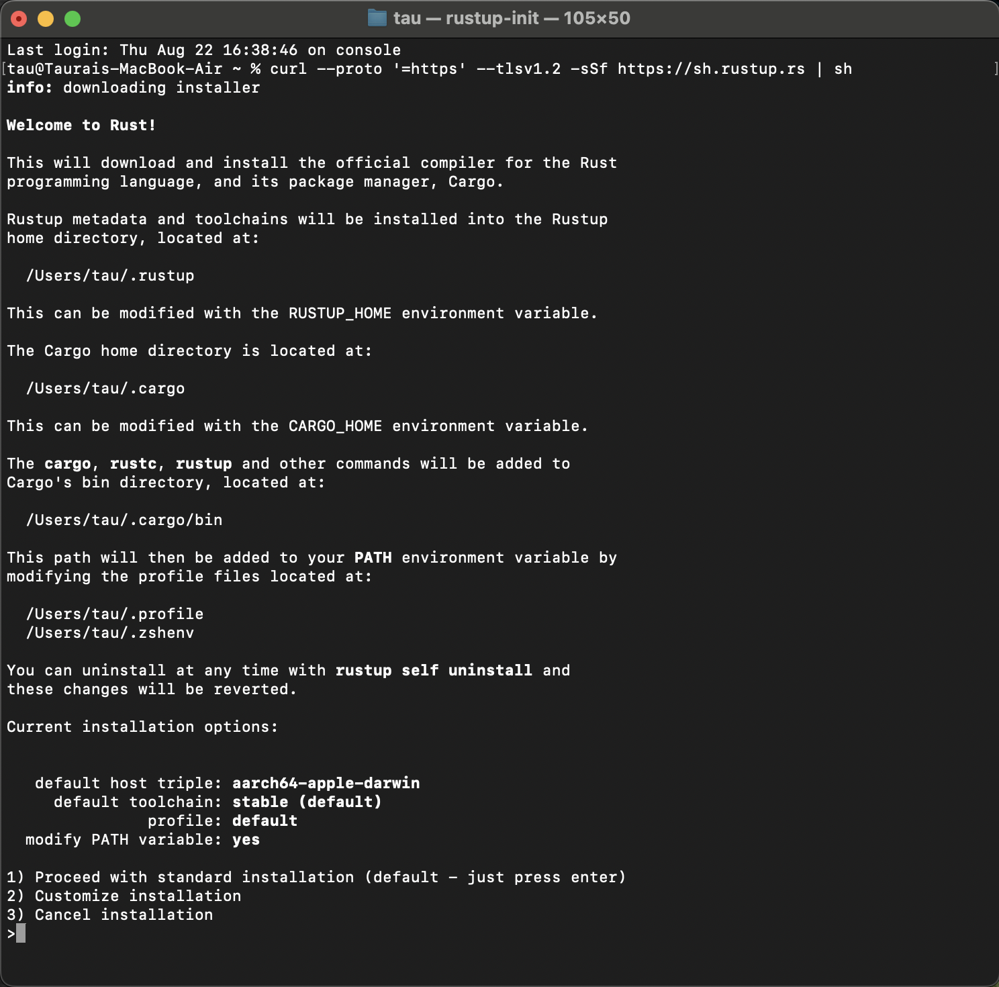
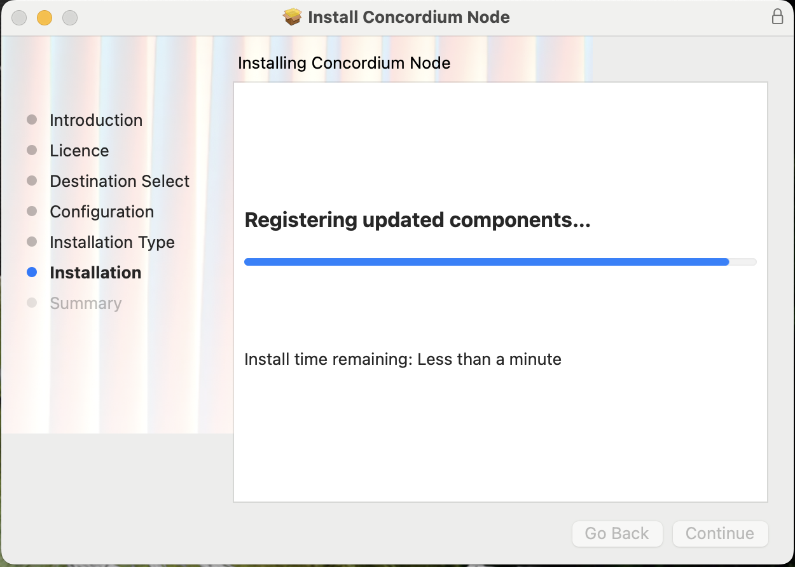

# Concordium Tutorial: Installing and Creating Your First dApp


## Introduction

Concordium is a powerful blockchain platform that offers unique features for developers, including:

1. Built-in identity and regulatory compliance
2. High scalability and low transaction fees
3. Rust-based smart contracts
4. Energy-efficient Proof-of-Stake consensus
5. Support for both public and private use cases

This tutorial will guide you through the process of setting up Concordium on your Linux system and creating your first "Hello World" decentralized application (dApp).

## Prerequisites

- A Linux distribution (Ubuntu 20.04 or later recommended) 
(this tutorial assumes you're working within a Linux environment. If you're using a different operating system, you'll need to adjust the commands accordingly. See more information on the [Rust website](https://www.rust-lang.org/tools/install).)
- Terminal access
- Basic familiarity with command-line operations

If you're not using Linux, you can still follow this tutorial to learn about the Concordium platform. However, you'll need to install the Concordium client on your system and use a different terminal to interact with the blockchain. For those, you will need the following:

- macOS 10.15 (Catalina) or later
- Windows 10 or later

## Step 1: Install Rust and Cargo

1. Open a terminal window.
2. Run the following command to download and run the Rust installation script: 

```curl --proto '=https' --tlsv1.2 -sSf https://sh.rustup.rs | sh```

3. Follow the on-screen prompts to complete the installation.



4. After installation, run:

```source $HOME/.cargo/env```

5. Verify the installation by running:

```rustc --version``` and   ```cargo --version```


## Step 2: Install Concordium-client

1. Install Concordium-client using the relevant installation file for your operating system:

Click here for the [macOS installation file](https://distribution.concordium.software/macos/signed/concordium-node-6.3.1.pkg)  


You can start and stop the concordium testnet node in the applications folder using the start and stop shortcuts.


## Step 3: Set up a Concordium wallet

1. Visit the [Concordium website downloads section](https://developer.concordium.software/en/mainnet/net/installation/downloads.html) and download the testnet wallet app for your device. 
2. Follow the in-app instructions to create a new account.
3. Make note of your account address, as you'll need it later.

## Step 4: Install Concordium smart contract development tools

1. Install the required tools using Cargo:

```cargo install cargo-concordium```

2. Verify the installation:

```cargo concordium --version```


## Step 5: Create a new Rust project

1. Create a new directory for your project:

```mkdir hello-world cd hello-world```

2. Initialize a new Rust project:

```cargo init ```


## Step 6: Update Cargo.toml

1. Open the `Cargo.toml` file in your preferred text editor:

```nano Cargo.toml```

2. Add the following dependencies and configuration:

```toml
[dependencies]
concordium-std = "5.1"

[lib]
crate-type = ["cdylib", "rlib"]
```
This is a part of the Cargo.toml file, which is the manifest for Rust projects. Here's what each section means:

```[dependencies]```: This section declares the external libraries (crates) that your project depends on.

```concordium-std = "5.1"```: This line specifies that the project depends on version 5.1 of the concordium-std crate, which provides the standard library for Concordium smart contract development.
```[lib]```: This section configures how the library should be built.

```crate-type = ["cdylib", "rlib"]```: This line specifies two types of libraries to be built:
```"cdylib"```: Produces a dynamic system library, which is necessary for creating WebAssembly modules for Concordium smart contracts.
```"rlib"```: Produces a "Rust library" file, which is useful for testing and linking with other Rust code.
This configuration ensures that your Rust project is set up correctly for Concordium smart contract development, with the necessary dependencies and build settings in place.

3. Save and close the file.

## Step 7: Write the smart contract code
1. Open the `src/lib.rs` file in your preferred text editor:

```nano src/lib.rs```

2. replace the existing code with the following:

```use concordium_std::*;

#[init(contract = "hello_world")]
fn init(_ctx: &InitContext, _state_builder: &mut StateBuilder) -> InitResult<()> {
    Ok(())
}

#[receive(contract = "hello_world", name = "say_hello")]
fn say_hello(_ctx: &ReceiveContext, _host: &Host) -> ReceiveResult<String> {
    Ok("Hello, World!".to_string())
}
```
This code defines a minimal smart contract that can be initialized on the Concordium blockchain and has one function, say_hello, which returns a greeting message when called. 

Let's break it down:

```use concordium_std::*;``` imports all the necessary types and functions from the Concordium standard library.

The ```#[init(contract = "hello_world")]``` attribute marks the init function as the initialization function for the ```"hello_world"``` contract. This function is called when the contract is deployed.

The ```init``` function takes two parameters (which are unused in this simple example) and returns ```InitResult<()>```. It simply returns ```Ok(())```, indicating successful initialization without any state.

The ```#[receive(contract = "hello_world", name = "say_hello")]``` attribute marks the say_hello function as a receive function for the ```"hello_world"``` contract. This function can be called after the contract is deployed.

The ```say_hello``` function also takes two parameters (unused here) and returns ```ReceiveResult<String>```. It returns ```Ok("Hello, Concordium!".to_string())```, which is the "Hello World" message as a String.


3. Save and close the file.

## Step 8: Build the smart contract

1. Build the smart contract using Cargo:
```cargo concordium build --out hello_world.wasm.v1```

This command is used to build the Concordium smart contract. Here's a breakdown of its components:

```cargo concordium```: This invokes the Concordium-specific Cargo subcommand, which is installed as part of the Concordium development tools.

```build```: This is the subcommand to compile the smart contract.

```--out hello_world.wasm.v1```: This flag specifies the output file name for the compiled smart contract. In this case, it will create a WebAssembly (Wasm) file named "hello_world.wasm.v1".

The ".v1" suffix in the filename indicates that this is version 1 of the smart contract, which is a common practice in Concordium development to manage different versions of contracts.

This command compiles your Rust code into a WebAssembly module that can be deployed and executed on the Concordium blockchain. The resulting .wasm file contains the bytecode of your smart contract, ready for deployment to the Concordium network.

## Step 9: Deploy the smart contract
1. Deploy the smart contract to the Concordium blockchain testnet:

```concordium-client module deploy hello_world.wasm.v1 --sender <YOUR_ACCOUNT_ADDRESS>```

This command is used to deploy the compiled smart contract to the Concordium blockchain. Here's a breakdown:

```concordium-client```: This is the command-line interface tool for interacting with the Concordium network.

```module deploy```: This subcommand tells the client to deploy a smart contract module.

```hello_world.wasm.v1```: This is the name of the compiled WebAssembly file containing your smart contract code.

```--sender <YOUR_ACCOUNT_ADDRESS>```: This flag specifies the account that will pay for the deployment transaction. You need to replace ```<YOUR_ACCOUNT_ADDRESS>``` with your actual Concordium account address.

When you run this command, it will send a transaction to the Concordium network to deploy your smart contract. The network will then store your contract code and make it available for initialization and interaction. 

2. Take note of the contract address (module reference) generated by the deployment process. You'll need it in the next step.

## Step 10: Initialize the smart contract

1. Initialize an instance of the smart contract with the following command:

```concordium-client contract init hello_world --sender <YOUR_ACCOUNT_ADDRESS> --energy 30000```

2. Note the contract instance ID generated by the initialization process. You'll need it in the next step.

## Step 11: Interact with the smart contract

1. Invoke the `say_hello` function of the smart contract using the following command:

```concordium-client contract update <CONTRACT_ADDRESS> --entrypoint say_hello --sender <YOUR_ACCOUNT_ADDRESS> --energy 30000```

<YOUR_ACCOUNT_ADDRESS> should be replaced with your actual account address.

2. You should see the following output:

```"Hello, World!"```

Congratulations! You've successfully created, deployed, and interacted with your first Concordium smart contract on Linux. This "Hello World" dApp demonstrates the basics of working with Concordium, including setting up the development environment, writing a simple smart contract, and interacting with it on the blockchain.

As you continue to explore Concordium, you'll discover more advanced features and capabilities that make it a powerful platform for building decentralized applications with built-in compliance and identity management.

